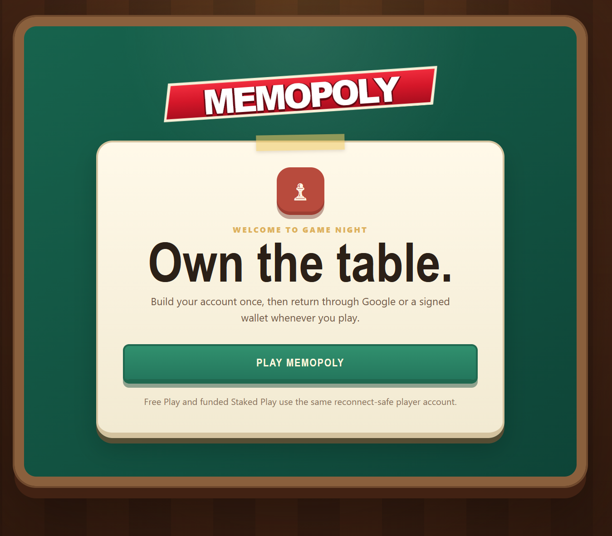
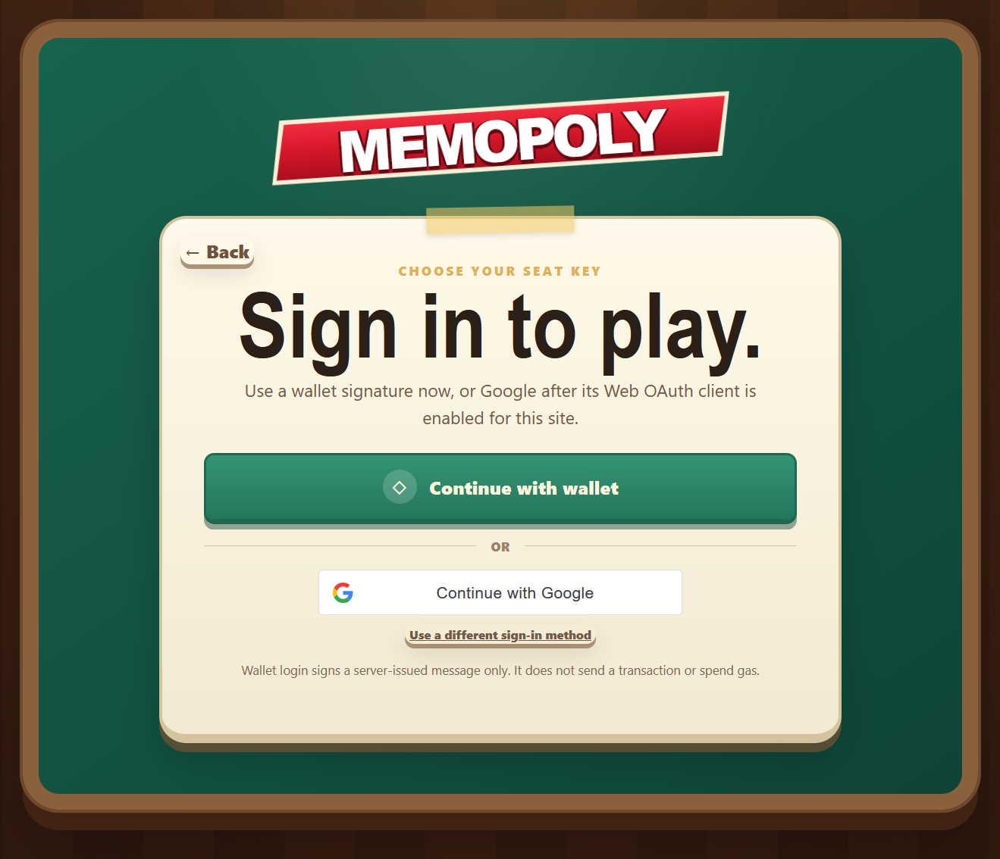
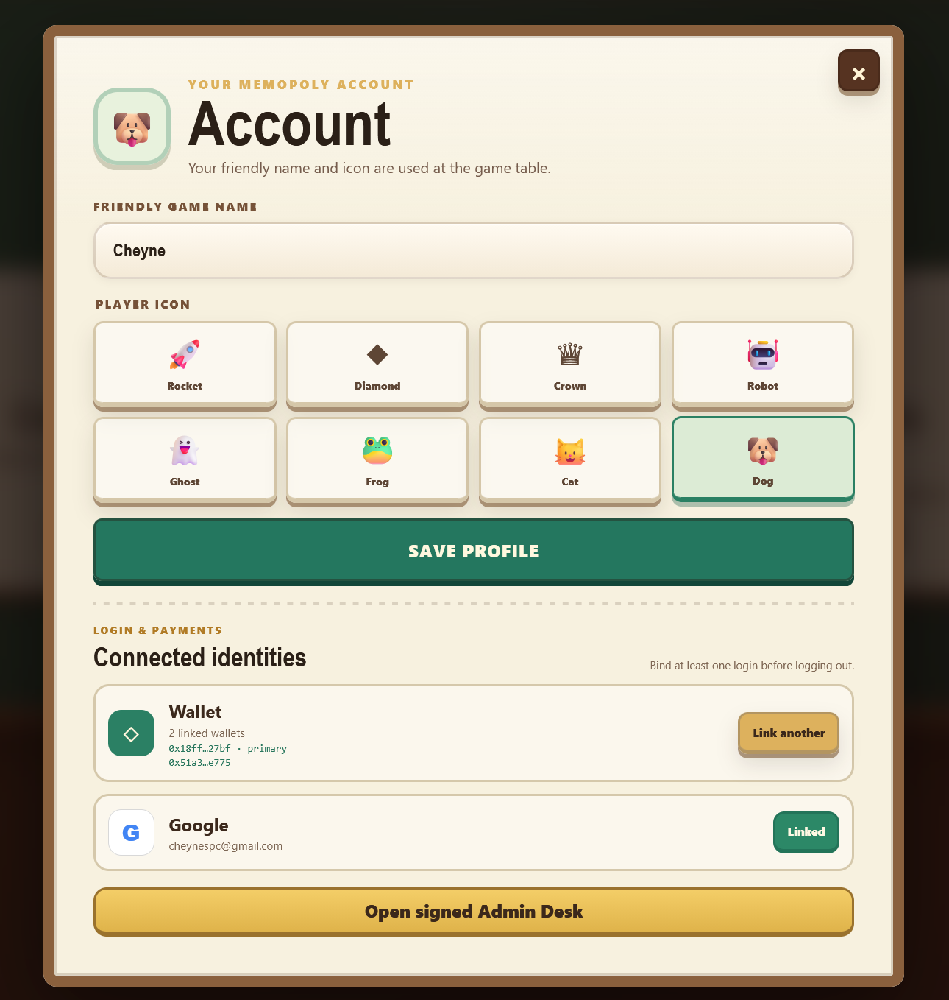
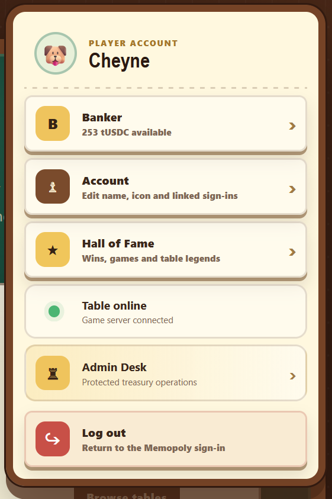
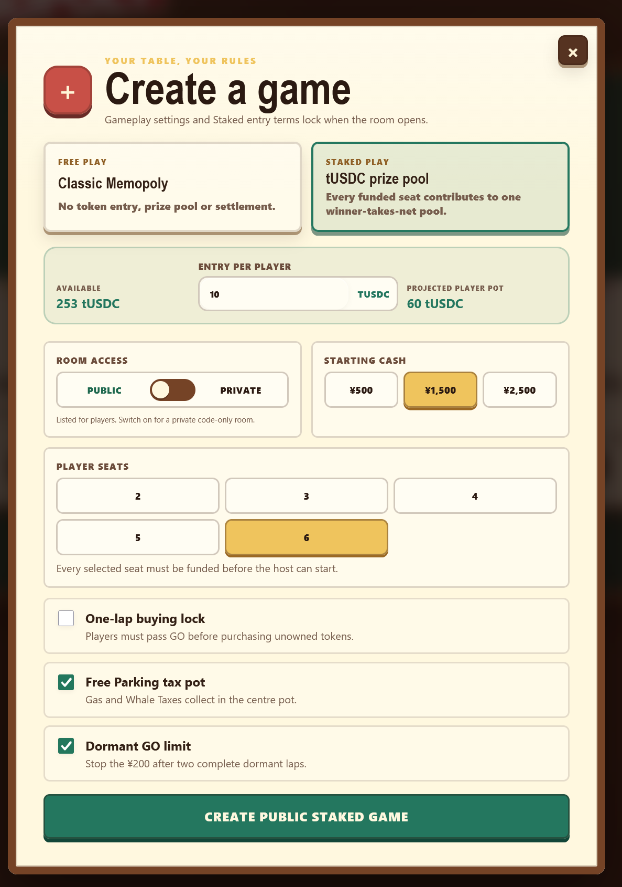
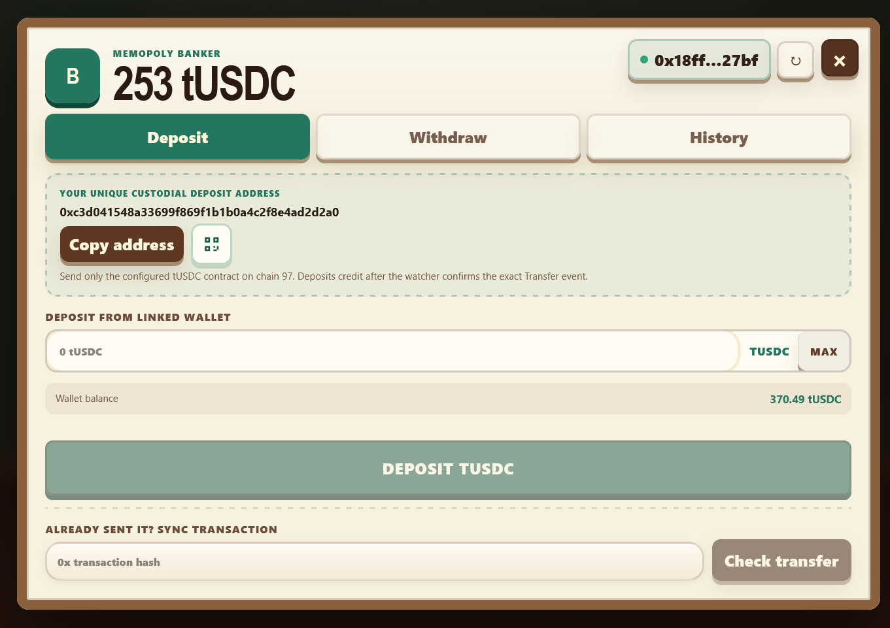
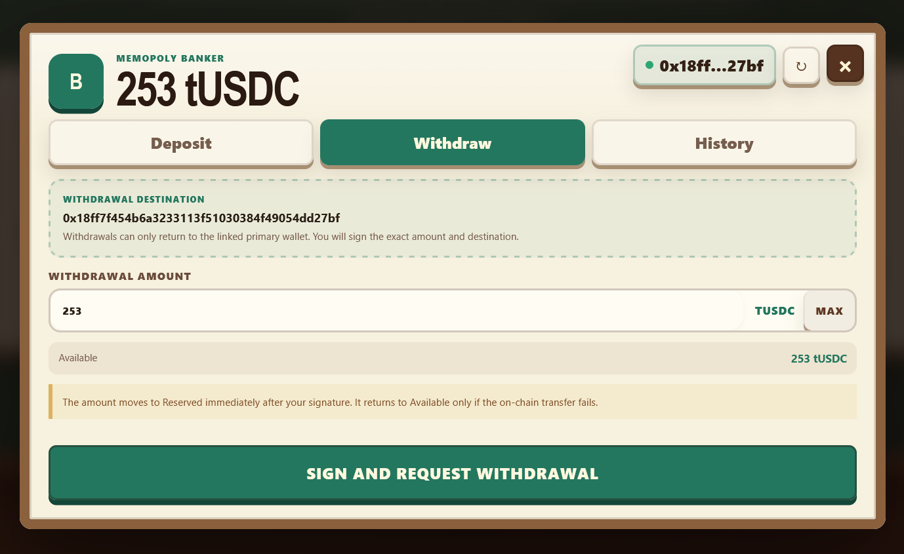

<div align="center">

# MEMOPOLY

**A live multiplayer crypto property strategy game with optional USDC-funded tables.**

[](https://memopoly.hausserver.xyz)
[](#run-with-docker)
[](#accounts-and-sign-in)
[](#usdc-staked-play)
[](#beta-status)

<a href="https://memopoly.hausserver.xyz">
  
</a>

**[Play the EVM live beta](https://memopoly.hausserver.xyz)**

**[Play the Solana live beta](https://memopoly-svm.hausserver.xyz)**

Free Play uses game-only currency. Staked Play uses the configured USDC-compatible token and a funded winner-takes-pool table.

</div>

---

## About Memopoly

Memopoly is a server-authoritative multiplayer property strategy game built around crypto, meme-token and DeFi themes. Players move around a 40-space board, buy token properties, collect rent, build Houses and Hotels, trade assets, use the Banker, draw cards and compete through live auctions.

The same player account can be used for both:

- **Free Play** — no token entry, prize pool or on-chain settlement.
- **Staked Play** — each funded seat contributes a fixed USDC-compatible token entry to a locked table prize pool.

The game keeps the familiar flow of a classic property board game while using an original browser interface, crypto-themed board, custom cards, multiplayer systems, persistent accounts and server-controlled rules.

<div align="center">
  
</div>

---

## Beta status

Memopoly is currently a public beta. Games, linked identities, player statistics, wallet funding records and active room state are persisted, but bugs and rule-edge cases may still be found during real multiplayer testing.

The current public screenshots show **tUSDC on chain 97**, which is a configured test deployment. Do not treat test tokens as production USDC. Production token contracts, chains and treasury settings must be explicitly configured and independently reviewed before real-value public use.

When reporting a problem, include:

- What action was taken.
- Which player was active.
- Whether the table was Free Play or Staked Play.
- The tile, modal, deposit, withdrawal or settlement step involved.
- What was expected.
- What happened instead.
- A screenshot, transaction hash and approximate time when relevant.

---

## Main features

### Multiplayer game engine

- Server-authoritative dice, movement, payments, ownership and turn deadlines.
- Private room codes and listed public games.
- Joinable waiting rooms and read-only spectator access for active games.
- Responsive board layout for desktop, portrait mobile and landscape mobile.
- Persistent player identity with refresh and reconnect support.
- Manual-control reclaim after autonomous or dormant play.
- Full 40-space crypto-themed board with colour groups, ramps, utilities, taxes, Jail and Free Parking.
- Property deed cards shared by tile inspection, purchase decisions and auctions.
- Houses, Hotels, even building rules, limited building supply, Mortgages and Unmortgages.
- Player-to-player trades containing game money, properties and eligible cards.
- Two server-shuffled draw-card decks with movement, payments and other effects.
- Movement-first sequencing: the piece reaches its destination before rent, fines, purchases, payouts or destination alerts appear.
- Sequential auctions where every remaining bidder receives a turn.
- Auction buttons for `+M1`, `+M10`, `+M50` and `+M100`; passing or timing out forfeits only that bidder.
- Free Parking pot funded by configured taxes and fines.
- Jail choices, mandatory payments and three-consecutive-doubles Jail handling.
- Compact board-centre payment and destination alerts.
- Live game ledger with payment source, destination, reason and amount.
- Banker portfolio, Hall of Fame, final standings and protected admin tools.

### Accounts, identity and access

- Signed EVM wallet login using a server-issued message.
- Google OAuth login for returning players.
- Multiple login methods can be linked to one persistent player account.
- Multiple wallets can be linked, with one primary wallet used for protected payment actions.
- Editable friendly game name and player icon.
- Signed-wallet authorization for protected administration.
- Logout protection requiring at least one usable linked login method.

### Web3 funding and settlement

- Per-player custodial deposit address.
- Configured USDC-compatible token and chain validation.
- Deposit watcher that credits only confirmed matching token transfer events.
- Manual transaction-hash sync for already-sent deposits.
- Available, Reserved and in-game balance accounting.
- Fixed Staked Play entry amount per funded seat.
- Projected prize-pool calculation before room creation.
- Seat-funding checks before a staked table may start.
- Prize pool isolated from ordinary in-game `M` currency.
- Winner settlement through the server-controlled game result flow.
- Withdrawals restricted to the linked primary wallet.
- Exact withdrawal amount and destination included in the signed request.
- Failed on-chain withdrawals return funds from Reserved to Available.
- Transaction and balance history visible from the Banker.

> `M` is Memopoly game currency only. It is used for board purchases, rent, taxes, trades and buildings. It is separate from USDC-compatible deposits, table entries, prize pools and withdrawals.

---

## Accounts and sign-in

Players can return through either a signed wallet or Google after linking both methods to the same account.

A wallet login signs a server-issued authentication message only. Signing in does **not** send a transaction and does not spend gas. Token transfers and withdrawals require separate, clearly presented actions.

<div align="center">
  
</div>

The account page lets a player update their table name and icon, review linked wallets, link another wallet, confirm their Google identity and open protected admin tools when authorized.

<div align="center">
  
</div>

The player menu provides direct access to the Banker, account settings, Hall of Fame, server status, protected Admin Desk and logout.

<div align="center">
  
</div>

---

## USDC staked play

Staked Play uses a fixed token entry amount for every funded seat. The host selects the entry amount, player count, room access and ordinary gameplay settings before the room opens.

The projected player pot is calculated as:

```text
entry per player × funded player seats = table prize pool
```

For example, six funded seats at `10 tUSDC` create a projected `60 tUSDC` prize pool.

<div align="center">
  
</div>

### Staked table lifecycle

1. Each player signs in to a persistent Memopoly account.
2. Each player funds their Banker balance using the configured token and chain.
3. The host creates a Staked Play room with a fixed entry per player.
4. Joining players must have enough Available balance to fund their seat.
5. Seat funds move into a protected reserved or in-game state before play starts.
6. The game proceeds using `M` game currency; token balances are not used for rent or board purchases.
7. The server finalizes the winner from the authoritative game state.
8. The configured prize pool is credited through the settlement ledger.
9. The winner may request withdrawal to their linked primary wallet.

Staked Play should remain disabled unless the configured token contract, chain, treasury liquidity, watcher confirmations, settlement worker and withdrawal path have all passed deployment-specific testing.

---

## Banker: deposits, balances and withdrawals

### Deposit funds

Every player receives a unique custodial deposit address. The Banker can initiate a transfer from the linked wallet, display a QR code, copy the deposit address or check an already-submitted transaction hash.

The deposit watcher must match the configured chain, token contract, destination address and exact transfer event before crediting the account.

<div align="center">
  
</div>

### Balance states

The cashier ledger separates funds by state:

- **Available** — may be used to fund a new staked seat or requested for withdrawal.
- **Reserved** — locked for a pending withdrawal, table entry or protected settlement operation.
- **In game** — committed to an active funded table until the authoritative game result is finalized.

This separation prevents the same token balance from being withdrawn and committed to a game at the same time.

### Withdraw funds

Withdrawals can return only to the linked primary wallet. The player signs the exact destination and amount before the request is accepted. The amount moves to Reserved immediately and returns to Available only when the on-chain transfer fails or is safely cancelled by the settlement process.

<div align="center">
  
</div>

---

## Basic player help

### 1. Create or join a game

From the lobby, create a room or join an available waiting room. Share the six-character room code with other players when using a private room. The room owner can start after the required players have joined and, for Staked Play, every selected seat is funded.

### 2. Choose Free Play or Staked Play

Use **Free Play** for games with no token entry or settlement.

Use **Staked Play** only after checking the entry amount, selected chain, configured token and projected prize pool. Funding a seat commits token balance independently of the `M` balance used during gameplay.

### 3. Take a turn

Select **Roll Dice** when it is your turn. The server generates the roll and moves your piece across the board. The destination is resolved only after the movement animation finishes.

A destination may result in:

- A purchase decision.
- Rent paid to another player in `M`.
- A tax or fine paid to the Banker or Free Parking pot in `M`.
- A Free Parking payout in `M`.
- A draw card.
- Jail or Just Visiting.
- No action on an ordinary owned or neutral space.

### 4. Buy a property

When landing on an available property, the purchase modal displays the full deed card, price, rent schedule, Mortgage value and building costs.

Choose **Buy** to purchase it or decline to send it to auction.

### 5. Auctions

Auctions proceed one bidder at a time. Use the `+M1`, `+M10`, `+M50` or `+M100` buttons to raise the current bid.

- Passing forfeits only your participation.
- Letting your auction timer expire also forfeits only your participation.
- Remaining players continue bidding.
- The auction ends when one valid bidder remains or all players forfeit without a bid.

### 6. Draw cards

When a player lands on a draw-card tile, the card opens first. Close the card, or allow its display timer to finish, before the effect is applied.

When a card moves the player, the sequence is:

1. Show the drawn card.
2. Close the card.
3. Move the piece.
4. Resolve the destination.
5. Show any resulting payment, purchase, Jail or payout alert.

### 7. Rent, fines and payments

Ordinary game payments are processed by the server in `M`. A compact alert appears in the board centre after movement and identifies:

- Who paid or received money.
- The amount.
- The payment reason.
- The recipient or destination.
- The payer's remaining balance when relevant.

The same information is recorded in the live game ledger.

### 8. Free Parking

Configured taxes and fines may add `M` to the Free Parking pot. A player landing directly on Free Parking receives the pot, and the pot resets.

A Free Parking award card appears only when money is actually transferred. No payout modal appears for an empty pot.

### 9. Jail

A player may be sent to Jail by the board, a card or three consecutive doubles. The Jail modal identifies the affected player and presents the available choices when a decision is required.

Landing on the Jail corner normally means **Just Visiting**.

### 10. Banker, buildings and Mortgages

Open the in-game **Banker** to manage owned properties, build or sell Houses and Hotels, Mortgage or Unmortgage eligible assets and review your portfolio.

Buildings must follow the even-building and even-selling rules across a complete colour set.

The account-level Banker handles token deposits, Staked Play balances, history and withdrawals. These are separate from the in-game property-management controls.

### 11. Trades

Use the trade desk to propose exchanges containing `M`, properties and eligible cards. The receiving player can accept or reject the offer before the trade timer expires.

USDC-compatible balances and prize-pool claims are not player-to-player trade items.

### 12. Returning after inactivity

A disconnected or inactive player may enter autonomous or dormant play so the table is not permanently blocked. Return to the game and use **Take back control** or **Resume manual play** when shown.

---

## System design

Memopoly separates game rules from token custody and settlement:

- **Game server** — authoritative rooms, turns, dice, movement, property state, `M` payments and game results.
- **Game worker** — deadlines, dormant actions, reconnect-safe progression and scheduled resolution.
- **Account service** — persistent players, friendly profiles and linked login identities.
- **Cashier ledger** — Available, Reserved and in-game token balances with auditable entries.
- **Deposit watcher** — validates confirmed transfers to assigned custodial addresses.
- **Settlement and withdrawal workers** — finalize prize credits and broadcast protected withdrawals.
- **MongoDB** — persistent users, rooms, games, balances, ledgers and transaction records.
- **Redis** — distributed locks, deadlines and short-lived coordination state.
- **Socket.IO** — real-time room and game updates.
- **Caddy and Docker Compose** — reverse proxy and service deployment.

A client display is never treated as the authority for token balance, seat funding, dice results, winner selection or prize settlement.

---

## Security model

The funded game path is designed around the following controls:

- Server-issued nonces for signed wallet authentication.
- Linked-wallet ownership proven by signature.
- One configured primary withdrawal wallet per account.
- Custodial addresses derived and managed only by the backend.
- Deposit credit based on confirmed token transfer events, not user-submitted amounts.
- Idempotent transaction processing and unique deposit references.
- Separate Available, Reserved and in-game balances.
- Server-authoritative seat funding and winner selection.
- Protected admin actions requiring an authorized signed wallet.
- Treasury liquidity and risk checks before withdrawals.
- No private keys, mnemonics, OAuth secrets, RPC credentials or admin tokens in the browser bundle or repository.

Real-value deployments require an independent security review, operational monitoring, protected secret storage, treasury controls and jurisdiction-specific legal assessment.

---


## Disclaimer

Memopoly is an independent game prototype. It is not affiliated with, sponsored by or endorsed by Hasbro, Monopoly, Circle, Google, any cryptocurrency, token, exchange, wallet or project represented or referenced by its theme.

`M` game currency, properties, Houses, Hotels, cards and ordinary board rewards have no real-world monetary value.

Staked Play is different: it may use a configured USDC-compatible blockchain token for table entry, prize-pool accounting and withdrawal. The current beta screenshots show a test token deployment. Token value, availability, finality, fees and regulatory treatment depend on the configured chain, contract and operating jurisdiction.

Users are responsible for verifying the destination address, network, token contract, entry amount and table terms before signing or transferring funds. Blockchain transactions may be irreversible. Do not deposit unsupported assets or use funds you cannot afford to lose.

The software is beta software provided without a guarantee of uninterrupted operation, successful settlement or fitness for a particular purpose. Real-value public operation should not begin without security review, treasury controls, monitoring, incident procedures and legal advice.

All third-party names and marks belong to their respective owners.
